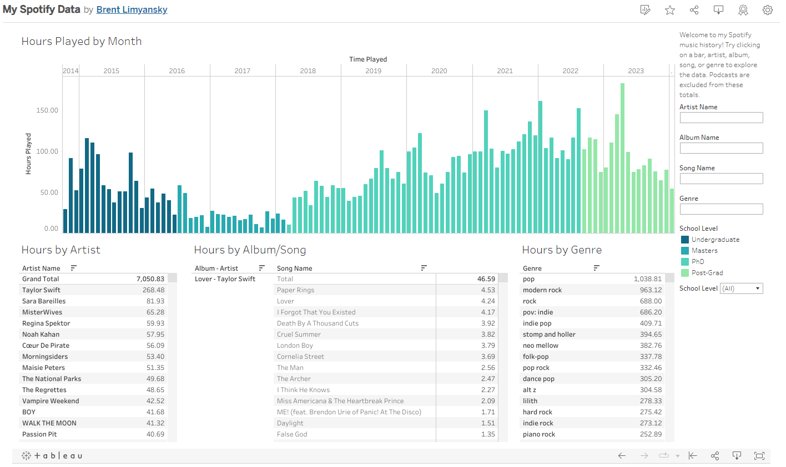

# my_spotify
I built a [Tableau Dashboard](https://public.tableau.com/views/MySpotifyData_17066362308130/Dashboard12?:language=en-US&:display_count=n&:origin=viz_share_link) to analyze my lifetime Spotify streaming history. This repository contains some helper scripts I used for data processing/accessing the Spotify API, as well as a copy of the Tableau Desktop ".twb" file I used for the analysis.



# Directory Structure
```
.
├── docs                    # Documentation files
│   └──images               # Images used in README
├── notebooks               # Tableau/Mathematica files used in exploration
├── python                  # Scripts for data processing/API access
└── README.md               # This file
```
